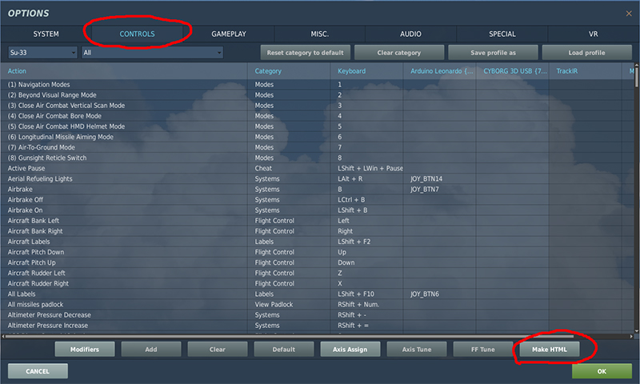
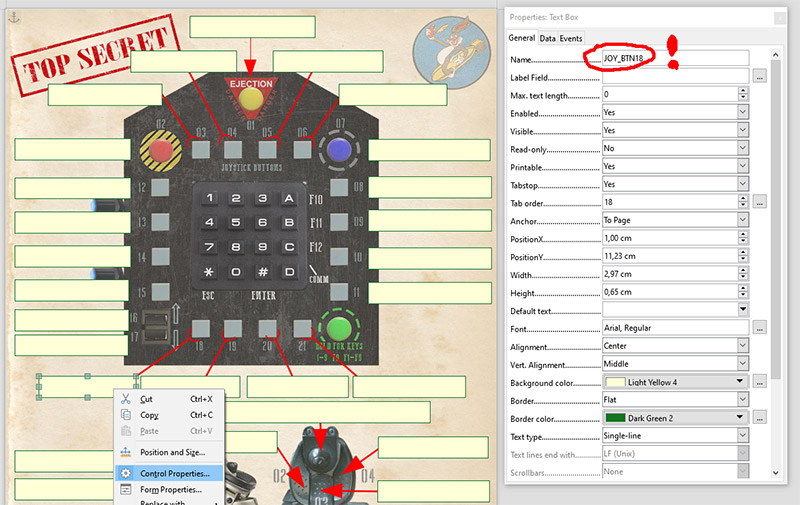
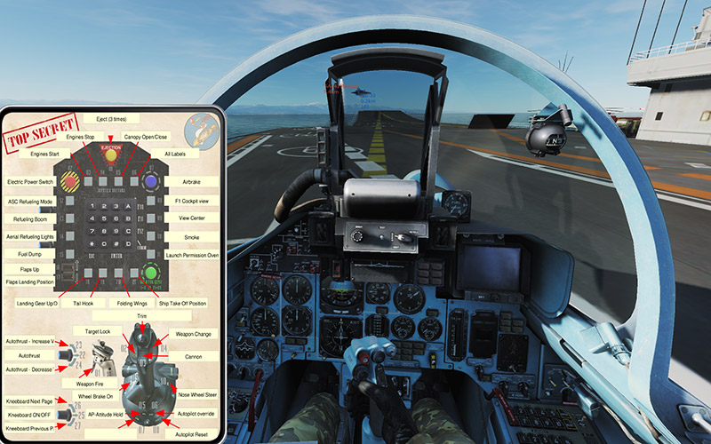

# DCS Controls Helper
Project website: https://github.com/bunnyhu/dcs_controls_helper

**Latest release: https://github.com/bunnyhu/dcs_controls_helper/releases**

Java application: **/dist/DcsControl.jar**

## Idea
This project is made for process the DCS (Digital Combat Simulator) joystick / Keyboard binds. Mostly used for my home made DIY controller box called DCS Buddy.

I am using a kneeboard sheet to remember the button functions, but sometimes I am redefined them inside DCS. It is painful to update my page because so many functions and hard to remember or found what is changed.

## Goal
The project able to read the exported DCS controls HTML file and connect them to PDF form text fields. You can use multiple controllers and separate the same commands like joystick buttons with prefix code.

For example my controller emulating a 27 button joystick with buttons JOY_BTN1..27 but my joystick also have JOY_BTN1..7. So I separate the joystick's buttons with SC_ prefix like SC_JOY_BTN1.

## How to use it
### Step 1

Set every key, joy button, axis etc in DCS. Use the **Make HTML** function in the *Options/controls* menu. 

The html files created into the " c:\Users\ *yourusername* \Saved Games\DCS\InputLayoutsTxt\ *airplanetype* " folder.

My folder look like this:
- Arduino Leonardo {0084B6C0-5546-11e9-8001-444553540000}.html 
- CYBORG 3D USB {76F52CE0-2F71-11e9-8001-444553540000}.html
- Keyboard.html 
- Mouse.html 
- TrackIR.html 

### Step 2

Make a PDF template with form text fields. I strongly suggest to make the template with Libre Office. That is free, easy to make the page with text fields, name it and save the document into a PDF file.

The form fields name will be follow the DCS controller names schema, like JOY_BTN1 
If you want to use more controller on one page, use prefix(es) that I suggested. 
Like JOY_BTN1 , TC_JOY_BTN1 , A_JOY_BTN1.

**How to make form field with Libre Office:**
- Menu: Form / Text Box 
- Menu: Form / Control properties => General / Name = *JOY_BTN1*
- Menu: File / Export as PDF (check the "Create PDF Form" box!)

Libre Office: https://www.libreoffice.org

### Step 3
- If the template is done, open my **DcsControl.jar** java application. You need the java runtime on your computer to run it.
- **Open PDF template**, then **Add DCS HTML** files that you want to attach to your template fields. Do not forget using prefix if you used it in the PDF template. You can check the command - action pairs in the table.
- Hit the **Fill & save as PDF template** button to save the final PDF file. If you do everything well, the text fields is filled with actions.

Java: https://www.java.com/en/
### Step 4
For using your hint sheet in the DCS, you must make a kneeboard page from the PDF.
Th easiest way is use the Kneeboard builder! That can import PDF and export into the correct folder like a Kneeboard page, and free of course.

http://www.dcskneeboardbuilder.com
### Step 5

Check the DCS controls page for command key to show the kneeboard inside your plane. Default Kneeboard on/off key is *RShift+K*, then change the pages till your hint sheet is on. If every default page is on, it will be a lot of page before yours!

# Example
In the Example folder there is a test PDF template and my SU-33 controls export files. 
- The Arduino Leonardo have no prefix.
- The Cyborg 3D USB have prefix: **SC_** (like SC_JOY_BTN1) please dont forget to set. It is uppercase!

# Licence
The java code is licensed under the GNU General Public License v3.0

# External Libraries
- [jsoup: Java HTML Parser](https://jsoup.org/)
- [Apache PDFBox 2.0](https://pdfbox.apache.org/)
